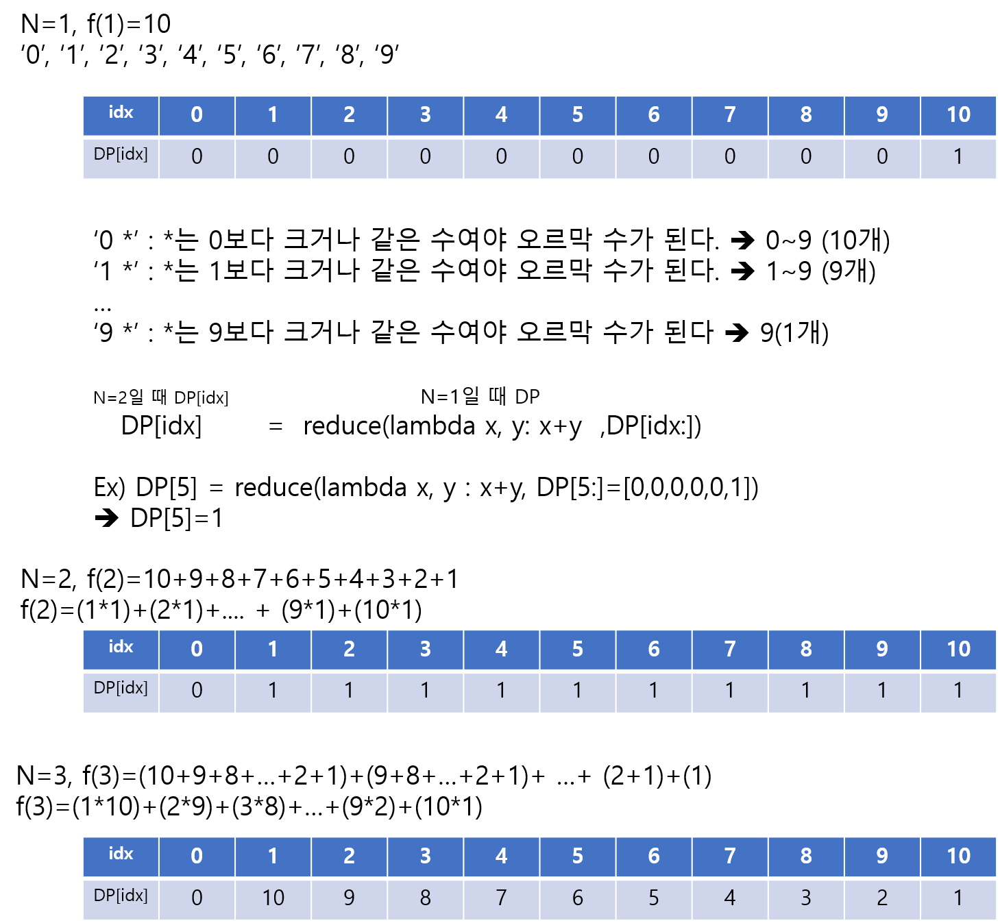

# 시도1 (실패: 시간초과)
- 방법 : 숫자길이가 N보다 작은 숫자의 마지막숫자보다 큰수를 붙여서, 리스트에 append하는 방법
```
(n=1)     (n=2)                                (n=3) 
'0' ----> '00', '01', '02', ..., '09'  ------> '000', '001', ...,'009'(10개)/ '011', '012', ..., '019'(9개)/ ... /'099'(1개)
'1' ----> '11', '12', ..., '19'
'2'
'3'
'4'
'5'
'6'
'7'
'8'
'9'
```

- 코드
```python
# -*- coding:utf-8 -*-
import sys
def cnt_nums(nums, N):
    while True: #nums의 맨앞 숫자길이가 N보다 작으면
        if len(nums[0])>=N:
            break
       #print('now: {}, length: {}'.format(nums[0] ,len(nums[0]))) #nums[0]의 길이를 출력
        x= nums.pop(0) #맨앞 숫자를 꺼낸다
        #print(x, type(x)) #맨앞 숫자를 출력해본다.
        target=x[-1]# target은 x의 맨마지막위치의 숫자이다.

        #i는 target뒤에 붙일 숫자
        #i는 target보다 크거나 같아야하므로
        for i in range(0,10):
            if str(i)>=target:
                tmp=x+str(i)
                nums.append(tmp)
    return nums
            
def main():
    N=int(sys.stdin.readline())
    result=0
    nums=[str(x) for x in range(0,10)]
    for i in range(2,N+1):
        #i 는 숫자길이: 2~N
        nums=cnt_nums(nums, N)
        result=len(nums)
    print(result%10007)
    
if __name__=='__main__':
    main()

```

<hr>

# 시도2 (성공! 88ms)
- 규칙찾느라 머리 터지는줄 알았다..ㅎㅎㅎ

```python
# -*- coding:utf-8 -*-
import sys
from functools import reduce

def main():
    N=int(sys.stdin.readline())
    dp=[0]*11

    dp[10]=1
    for _ in range(1,N+1):# 1부터 N까지 dp 리스트 갱신
        for idx in range(1,11):
            dp[idx] =reduce(lambda x,y: x+y, dp[idx:])
    result=sum(dp)
    print(result%10007)
    
if __name__=='__main__':
    main()

```

## 풀이과정

(1) python의 기본내장 라이브러리 functools의 reduce를 이용
- reduce(lambda x,y : x+y , [1,2,3] ) =6
- x:1, y:2 => x+y=1+2=3
- x:3, y:3 => x+y=3+3=6

<br>

(2) 규칙



